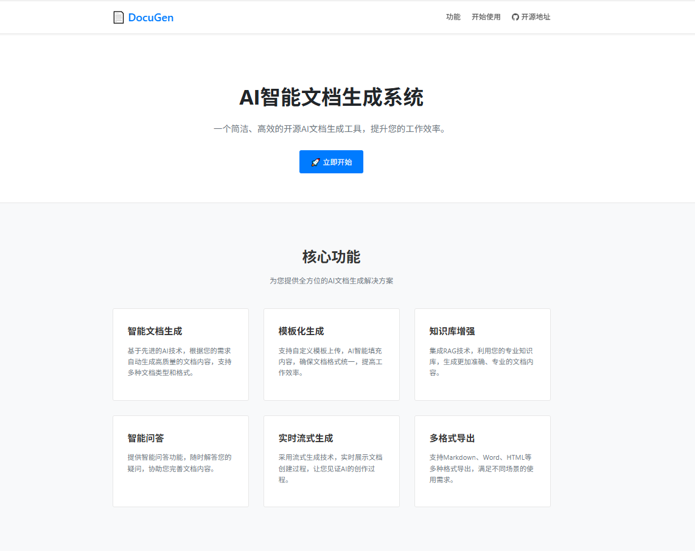
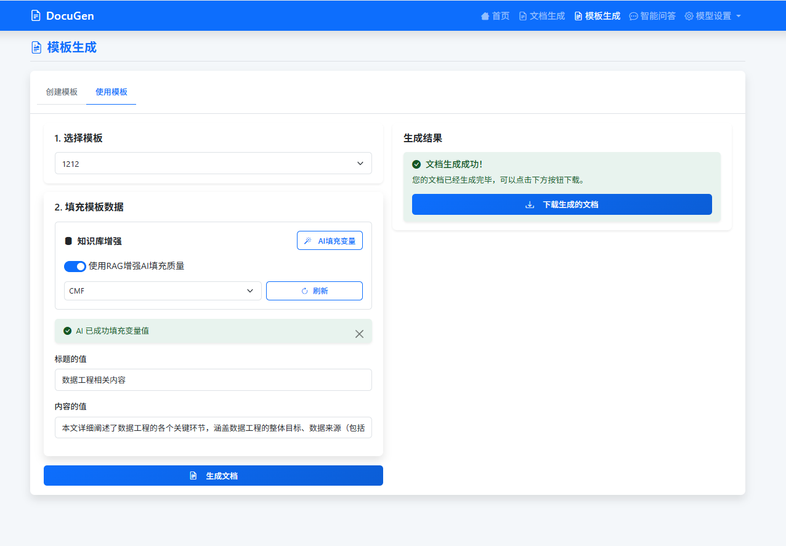
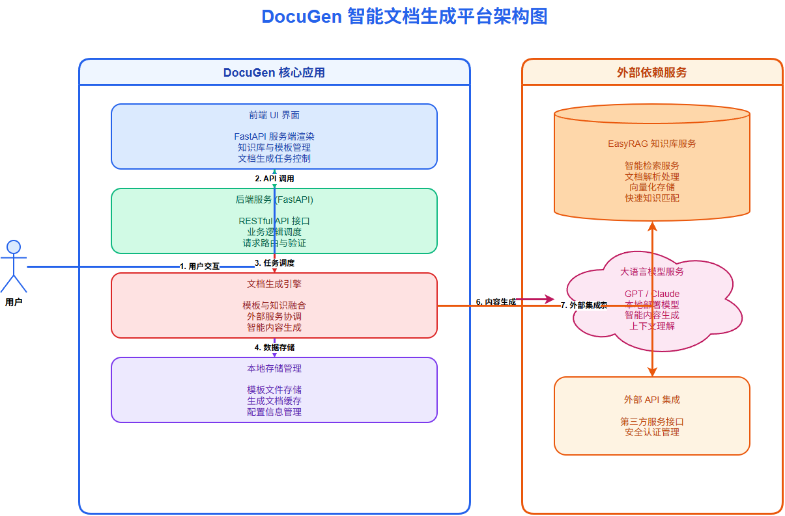

<div align="center">

# DocuGen 🖋️

✨ **AI智能文档生成系统** ✨

*让知识库变成你的专属写作助手*

</div>

<p align="center">
  <a href="http://124.132.152.75:8080/" target="_blank">
    
  </a>
  <a href="https://github.com/BetaStreetOmnis/EasyRAG">
    
  </a>
  <a href="https://www.python.org/">
    
  </a>
</p>

---

## 🎯 这是什么？

**DocuGen** = 你的知识库 + AI大模型 = 自动生成专业文档

上传你的资料 → 选择模板 → 一键生成文档，就这么简单！



> 说明：本仓库仅开源后端 API，Web 界面未包含。

## ⚡ 快速开始

### 1️⃣ 准备知识库（使用 EasyRAG）

先去 [EasyRAG](https://github.com/BetaStreetOmnis/EasyRAG) 上传你的文档资料：

- 📄 支持 PDF、Word、Markdown 等格式
- 🔍 自动建立向量索引，智能检索
- 🌐 在线体验：http://easyrag.net/static/index.html

### 2️⃣ 启动 DocuGen 服务

```bash
# 安装依赖
pip install -r requirements.txt

# 启动服务
python -m backend.app
```

### 3️⃣ 通过 API 生成文档

访问 http://127.0.0.1:8080/docs（或按 `.env` 的 `APP_PORT`），查看接口文档并通过 API 调用生成。


## 🧭 使用引导

- 文档版引导：见 `docs/USAGE.md`
- 模板占位符：支持 `【变量】` 或 `{{变量}}`

## 🎨 模板功能

### 智能模板生成
系统内置多种文档模板，也支持自定义：


### 模板效果预览
生成的文档格式专业，内容准确：



## 🏗️ 系统架构



- **DocuGen**：负责文档生成和模板管理
- **EasyRAG**：负责知识库管理和智能检索  
- **LLM服务**：提供AI写作能力

## 📋 配置说明

在 `.env` 文件中配置：

```bash
# 应用配置
APP_HOST=0.0.0.0
APP_PORT=8080

# LLM配置（OpenAI 兼容接口）
DEFAULT_LLM_TYPE=third_party
THIRD_PARTY_LLM_BASE_URL=你的大模型API地址
THIRD_PARTY_LLM_API_KEY=你的API密钥
THIRD_PARTY_LLM_DEFAULT_MODEL=模型名

# EasyRAG（RAG）配置（注意：不需要带 http://）
RAG_HOST=127.0.0.1:8024
```

## ❓ 常见问题

**Q: 看不到我的知识库？**  
A: 确保 EasyRAG 服务正在运行，检查 `.env` 里的 `RAG_HOST` 配置。

**Q: 生成内容不准确？**  
A: 优化知识库内容质量，使用更强的 LLM 模型。

**Q: 支持哪些文档格式？**  
A: 取决于 EasyRAG 的支持，详见其[项目文档](https://github.com/BetaStreetOmnis/EasyRAG)。

---

<div align="center">

**⭐ 如果这个项目对你有帮助，请给个 Star！**

[🚀 在线体验](http://124.132.152.75:8080/) • [📚 知识库项目](https://github.com/BetaStreetOmnis/EasyRAG)

</div>
