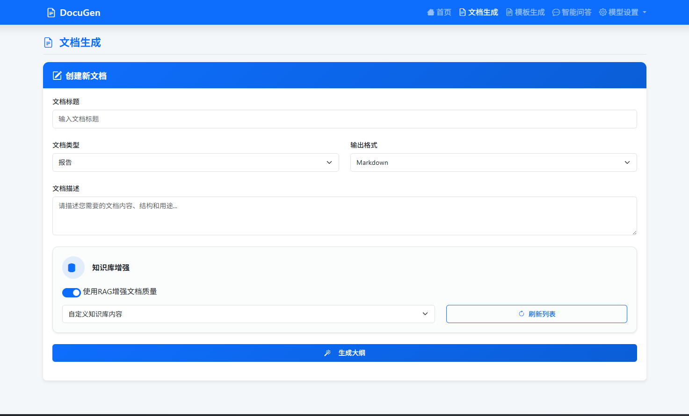

<div align="center">

# DocuGen 🖋️

✨ **An Intelligent Document Generation System Based on Knowledge Base** ✨

</div>

<p align="center">
  <a href="http://150.138.81.55:8080/" target="_blank">
    
  </a>
  <a href="LICENSE">
    
  </a>
  <a href="https://www.python.org/">
    
  </a>
  <a>
    
  </a>
  <a>
    
  </a>
</p>

<h3 align="center">
  <a href="http://150.138.81.55:8080/"><strong>🚀 Try the Live Demo &raquo;</strong></a>
</h3>

<p align="center">
  <a href="#1-overview">Overview</a> •
  <a href="#2-core-features">Core Features</a> •
  <a href="#3-architecture">Architecture</a> •
  <a href="#4-installation--configuration">Installation & Configuration</a> •
  <a href="#5-usage">Usage</a> •
  <a href="#6-faq">FAQ</a>
</p>

---

## 1. Overview

**DocuGen** is an advanced document generation tool that leverages Large Language Models (LLMs) and a knowledge base to transform unstructured or structured knowledge sources into beautifully formatted and accurate professional documents. Whether you are creating technical manuals, research reports, API documentation, or market analyses, DocuGen can significantly enhance the efficiency and quality of your content creation.

This project aims to solve common pain points in traditional document writing, such as scattered information, inconsistent formatting, and time-consuming efforts. Through an intelligent and automated approach, it empowers teams and individuals to focus on the knowledge itself, rather than on tedious formatting and writing.



## 2. Core Features

- **✨ Intelligent Knowledge Extraction**: Connect to your local files, databases, or knowledge sources like Notion to automatically extract and understand core content.
- **📚 Knowledge Base Management**: Built-in vectorization and indexing capabilities to construct your knowledge sources into a structured knowledge base that can be queried and referenced by the LLM.
- **📝 Template-Driven Generation**: Supports custom document templates (in Markdown format), allowing you to pre-define the document structure, chapter titles, and fixed content, with AI filling in the details.
- **🤖 LLM-Powered Writing**: Generates fluent, coherent, and context-aware paragraphs based on templates and the knowledge base, using LLMs like GPT, Claude, or local models.
- **🔍 Content Traceability & Verification**: Every piece of generated content can be traced back to its original source, facilitating fact-checking and citations.
- **🚀 Multi-Format Export**: Supports one-click export of generated documents to various common formats like Markdown, PDF, and more.

## 3. Architecture

DocuGen uses a modular design with a decoupled front-end and back-end to ensure system flexibility and scalability.

1.  **UI (User Interface)**: A web interface, rendered server-side via the FastAPI framework, for managing knowledge bases, editing templates, and initiating document generation tasks.
2.  **Backend Service**: Based on Python (FastAPI), it handles API requests and orchestrates the core business logic.
3.  **Knowledge Base Module**: The core knowledge base functionality is provided by the independent open-source project **[EasyRAG](https://github.com/BetaStreetOmnis/EasyRAG)**. DocuGen interacts with the EasyRAG service via API for document uploading, vectorization, and intelligent retrieval.
4.  **Generation Engine**: Encapsulates the interaction logic with the LLM, combining templates and retrieved knowledge to generate the final document.
5.  **LLM Service**: Can be configured to connect to various third-party or locally-deployed Large Language Model services.


## 4. Installation & Configuration

### 4.1 Prerequisites

- Python 3.8+
- A running instance of the [EasyRAG](https://github.com/BetaStreetOmnis/EasyRAG) service
- Access to an LLM API service

### 4.2 Install Dependencies

```bash
pip install -r requirements.txt
```

### 4.3 Configuration

In your `config.py` or `.env` file, configure your service information:

```python
# LLM Configuration
LLM_CONFIG = {
    "API_BASE_URL": "Your LLM API Base URL",
    "API_KEY": "Your LLM API Key",
    "MODEL_NAME": "The model name you want to use",
}

# Dependencies Configuration
DEPENDENCIES_CONFIG = {
    "EASYRAG_API_URL": "http://127.0.0.1:8000" # The API URL of your deployed EasyRAG service
}
```

## 5. Usage

### 5.1 Start the Services

1.  **Start the EasyRAG Service**: Follow the [EasyRAG project documentation](https://github.com/BetaStreetOmnis/EasyRAG) to start its API service.
2.  **Start the DocuGen Service**:
    ```bash
    python app.py
    ```
    > **Note**: Please ensure that DocuGen (e.g., running on port 8080) and EasyRAG (default API on port 8000) are running on different ports to avoid conflicts.

### 5.2 Workflow

1.  **Step 1: Manage Knowledge Base (in EasyRAG)**
    - Open the EasyRAG web interface (default: `http://127.0.0.1:8024`), Live Demo: http://150.138.81.55:8024/static/index.html.
    - Follow its instructions to create your knowledge base and upload your documents.

2.  **Step 2: Generate Document (in DocuGen)**
    - Access the DocuGen application interface (e.g., `http://127.0.0.1:8080`).
    - The interface will automatically list the knowledge bases you have created in EasyRAG.
    - Select a knowledge base, choose a document template, enter your generation requirements, and click "Generate Document".

3.  **Step 3: Preview and Export**
    - The system will call EasyRAG to retrieve relevant knowledge and generate the document in conjunction with the LLM.
    - You can preview, fine-tune, and export the final document within DocuGen.

## 6. FAQ

- **Q: Why can't I see my knowledge base in DocuGen?**
  - **A**: Please first ensure that your EasyRAG service is running correctly and that the `EASYRAG_API_URL` in DocuGen's configuration file is correct.

- **Q: What types of source files are supported?**
  - **A**: This depends on the support provided by the EasyRAG project. Please consult the [EasyRAG documentation](https://github.com/BetaStreetOmnis/EasyRAG) for a list of supported file types.

- **Q: What if the generated document content is inaccurate?**
  - **A**: This could be due to low-quality content in the knowledge base or a misunderstanding by the LLM. It is recommended to optimize the source files in your knowledge base for clarity and structure. You can also try adjusting the prompt in `config.py` or switching to a more powerful LLM.

- **Q: Can I connect to my own local model?**
  - **A**: Yes. As long as your local model provides an OpenAI-compatible API, you just need to modify the `API_BASE_URL` and `MODEL_NAME` in the configuration file. 