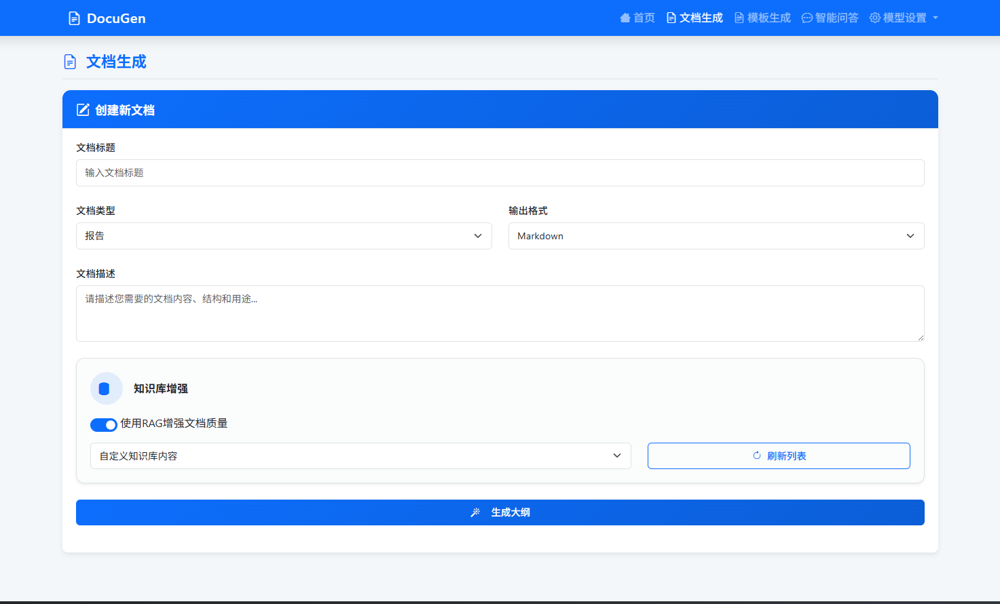

<div align="center">

# DocuGen 🖋️

✨ **基于知识库的智能文档生成系统** ✨

</div>

<p align="center">
  <a href="http://150.138.81.55:8080/" target="_blank">
    
  </a>
  <a href="LICENSE">
    
  </a>
  <a href="https://www.python.org/">
    
  </a>
  <a>
    
  </a>
  <a>
    
  </a>
</p>

<h3 align="center">
  <a href="http://150.138.81.55:8080/"><strong>🚀 在线体验 Demo &raquo;</strong></a>
</h3>

<p align="center">
  <a href="#1-项目概述">项目概述</a> •
  <a href="#2-核心功能">核心功能</a> •
  <a href="#3-技术架构">技术架构</a> •
  <a href="#4-安装与配置">安装与配置</a> •
  <a href="#5-使用方法">使用方法</a> •
  <a href="#6-常见问题-faq">常见问题</a>
</p>

---

## 1. 项目概述

**DocuGen** 是一款先进的文档生成工具，它利用大语言模型（LLM）和知识库，将非结构化或结构化的知识源转化为格式精美、内容准确的专业文档。无论是生成技术手册、研究报告、API文档还是市场分析，DocuGen 都能显著提升内容创作的效率和质量。

本项目旨在解决传统文档撰写过程中信息零散、格式不一、耗时耗力等痛点，通过智能化、自动化的方式，赋能团队和个人，使其专注于知识本身，而非繁琐的排版与写作。



## 2. 核心功能

- **✨ 智能知识提取**: 能够连接到您的本地文件、数据库或Notion等知识源，自动提取和理解核心内容。
- **📚 知识库管理**: 内置向量化和索引功能，将您的知识源构建成一个可供LLM查询和引用的结构化知识库。
- **📝 模板驱动生成**: 支持自定义文档模板（Markdown格式），您可以预设文档结构、章节标题和固定内容，由AI填充细节。
- **🤖 LLM智能撰写**: 基于模板和知识库，调用大语言模型（如 GPT、Claude 或本地模型）生成流畅、连贯且符合上下文的段落。
- **🔍 内容溯源与验证**: 生成的每一部分内容都可追溯回原始知识源，方便事实核查与引用。
- **🚀 多格式导出**: 支持将生成的文档一键导出为Markdown、PDF等多种常用格式。

## 3. 技术架构

DocuGen 采用前后端分离的模块化设计，确保系统的灵活性和可扩展性。

1.  **前端界面 (UI)**: 基于FastAPI框架，通过服务器端渲染提供一个直观的Web界面，用于管理知识库、编辑模板和发起文档生成任务。
2.  **后端服务 (Backend)**: 基于Python（FastAPI），处理API请求，调度核心业务逻辑。
3.  **知识库模块 (Knowledge Base Module)**: 核心知识库功能由独立的开源项目 **[EasyRAG](https://github.com/BetaStreetOmnis/EasyRAG)** 提供。DocuGen 通过 API 与 EasyRAG 服务进行交互，实现文档的上传、向量化和智能检索。
4.  **文档生成引擎 (Generation Engine)**: 封装了与LLM的交互逻辑，结合模板和检索到的知识，生成最终文档。
5.  **LLM服务**: 可配置接入各种第三方或本地部署的大语言模型服务。


## 4. 安装与配置

### 4.1 环境要求

- Python 3.8+
- 一个正在运行的 [EasyRAG](https://github.com/BetaStreetOmnis/EasyRAG) 服务实例
- 拥有一个可访问的LLM API服务

### 4.2 安装依赖

```bash
pip install -r requirements.txt
```

### 4.3 配置

在 `config.py` 或 `.env` 文件中，配置您的服务信息：

```python
# LLM配置
LLM_CONFIG = {
    "API_BASE_URL": "您的LLM API地址",
    "API_KEY": "您的API密钥",
    "MODEL_NAME": "您要使用的模型名称",
}

# 依赖服务配置
DEPENDENCIES_CONFIG = {
    "EASYRAG_API_URL": "http://127.0.0.1:8000" # 您部署的EasyRAG API地址
}
```

## 5. 使用方法

### 5.1 启动服务

1.  **启动 EasyRAG 服务**: 根据 [EasyRAG 项目文档](https://github.com/BetaStreetOmnis/EasyRAG)，启动其 API 服务 (通常是 `python api_server.py`)。
2.  **启动 DocuGen 服务**:
    ```bash
    python app.py
    ```
    > **注意**: 请确保 DocuGen (例如运行在8080端口) 和 EasyRAG (默认API在8000端口) 运行在不同的端口以避免冲突。

### 5.2 操作流程

1.  **步骤一：管理知识库 (在 EasyRAG 中)**
    - 打开 EasyRAG 的 Web 界面 (默认为 `http://127.0.0.1:8024`), demo地址：http://150.138.81.55:8024/static/index.html。
    - 根据其指引，创建您的知识库并上传文档资料。

2.  **步骤二：生成文档 (在 DocuGen 中)**
    - 访问 DocuGen 的应用界面 (例如 `http://127.0.0.1:8080`)。
    - 在界面上，系统会自动列出您在 EasyRAG 中已创建的知识库。
    - 选择知识库和文档模板，输入生成要求，点击"生成文档"。

3.  **步骤三：预览和导出**
    - 系统将调用 EasyRAG 检索相关知识，并结合 LLM 生成文档。
    - 您可以在 DocuGen 中在线预览、微调，并导出最终的文档。

## 6. 常见问题 (FAQ)

- **Q: 为什么在 DocuGen 中看不到我的知识库？**
  - **A**: 请先确认您的 EasyRAG 服务是否已正常启动，并且 DocuGen 的配置文件中 `EASYRAG_API_URL` 地址是否正确。

- **Q: 支持哪些类型的知识源文件？**
  - **A**: 这取决于 EasyRAG 项目的支持。请查阅 [EasyRAG 的文档](https://github.com/BetaStreetOmnis/EasyRAG) 以获取其支持的文件类型列表。

- **Q: 生成的文档内容不准确怎么办？**
  - **A**: 可能是知识库内容质量不高，或LLM的理解有偏差。建议优化知识库源文件，使其内容更清晰、结构化。也可以尝试在 `config.py` 中调整 Prompt 或更换更强大的LLM模型。

- **Q: 我可以连接自己的本地模型吗？**
  - **A**: 可以。只要您的本地模型提供与OpenAI兼容的API接口，只需在配置文件中修改 `API_BASE_URL` 和 `MODEL_NAME` 即可。
